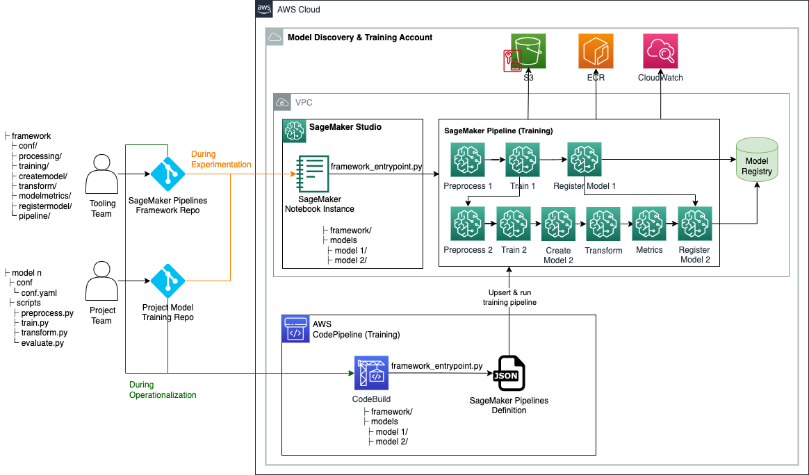

## Dynamic Sagemaker Pipelines Framework
In this repo, we present a framework for automating SageMaker Pipelines DAG creation based on simple configuration files. The framework code starts by reading the configuration file(s); and then dynamically creates a SameMaker Pipelines DAG based on the steps declared in the configuration file(s) and the interactions/dependencies among steps. This orchestration framework caters to both single-model and multi-model use cases; and ensures smooth flow of data and processes.

### Architecture Diagram

The following architecture diagram depicts how the proposed framework can be used during both experimentation and operationalization of ML models.



### Repository Structure 

This repo contains the following directories and files: 

- **/framework/conf/**: This directory contains a configuration file that is used to set common variables across all modeling units such as subnets, security groups, and IAM role at the runtime. A modeling unit is a sequence of up to 6 steps for training an ML model 
- **/framework/createmodel/**: This directory contains a Python script that creates a SageMaker Model object based on model artifacts from a Training Step 
- **/framework/modelmetrics/**: This directory contains a Python script that creates a SageMaker Processing job for generating a model metrics JSON report for a trained model 
- **/framework/pipeline/**: This directory contains Python scripts that leverage Python classes defined in other framework directories to create or update a SageMaker Pipelines DAG based on the specified configurations. The model_unit.py script is used by pipeline_service.py to create one or more modeling units. Each modeling unit is a sequence of up to 6 steps for training an ML model: process, train, create model, transform, metrics, and register model. Configurations for each modeling unit should be specified in the model’s respective repository. The pipeline_service.py also sets dependencies among SageMaker Pipelines steps (i.e., how steps within and across modeling units are sequenced and/or chained) based on sagemakerPipeline section which should be defined in the configuration file of one of the model repositories (i.e., the anchor model)
- **/framework/processing/**: This directory contains a Python script that creates a generic SageMaker Processing job 
- **/framework/registermodel/**: This directory contains a Python script for registering a trained model along with its calculated metrics in SageMaker Model Registry 
- **/framework/training/**: This directory contains a Python script that creates a SageMaker Training job 
- **/framework/transform/**: This directory contains a Python script that creates a SageMaker Batch Transform job. In the context of model training, this is used to calculate the performance of a trained model on test data •	/framework/utilities/: This directory contains utility scripts for reading and joining configuration files, as well as logging 
- **/framework_entrypoint.py**: This file is the entry point of the framework code. It simply calls a function defined in the /framework/pipeline/ directory to create or update a SageMaker Pipelines DAG and execute it 
- **/examples/**: This directory contains several examples of how this automation framework can be used to create simple and complex training DAGs 
- **/env.env**: This file allows to set common variables such as subnets, security groups, and IAM role as environment variables 
- **/requirements.txt**: This file specifies Python libraries that are required for the framework code

### Deployment Guide 

Follow the steps below in order to deploy the solution:

1. Organize your model training repository, for example according to the following structure:

    ```
    <MODEL-DIR-REPO>
    .
    ├── <MODEL-DIR>
    |   ├── conf
    |   |   └── conf.yaml
    |   └── scripts
    |       ├── preprocess.py
    |       ├── train.py
    |       ├── transform.py
    |       └── evaluate.py
    └── README.md
    ```

1. Clone the framework code and your model(s) source code from the Git repositories:

    a.	Clone `dynamic-sagemaker-pipelines-framework` repo into a training directory. Here we assume the training directory is called `aws-train` : 


        git clone https://github.com/aws-samples/dynamic-sagemaker-pipelines-framework.git aws-train

    b. Clone the model(s) source code under the same directory. For multi-model training repeat this step for as many models you require to train.  
  

        git clone https:<MODEL-DIR-REPO>.git aws-train

        For a single-model training, your directory should look like:

        <aws-train>  
        .  
        ├── framework
        └── <MODEL-DIR>

        For multi-model training, your directory should look like:

        <aws-train>  
        .  
        ├── framework
        └── <MODEL-DIR-1>
        └── <MODEL-DIR-2>
        └── <MODEL-DIR-3>


1. Set up the following environment variables. Asterisks indicate environment variables which are required, while the rest are optional.  

  
    | Environment Variable | Description |
    | ---------------------| ------------|
    | SMP_ACCOUNTID*        |    AWS Account where SageMaker Pipeline is executed |
    | SMP_REGION*           |    AWS Region where SageMaker Pipeline is executed |
    | SMP_S3BUCKETNAME*     |    Amazon S3 bucket name |
    | SMP_ROLE*             |   Amazon SageMaker execution role |
    | SMP_MODEL_CONFIGPATH* |   Relative path of the of single-model or multi-model configuration file(s) |
    | SMP_SUBNETS          |  Subnet IDs for SageMaker networking configuration |
    | SMP_SECURITYGROUPS   |   Security group IDs for SageMaker networking configuration |

    Note:

        a. For single-model use cases: SMP_MODEL_CONFIGPATH="<MODEL-DIR>/conf/conf.yaml" 

        b. For multi-model  use cases: SMP_MODEL_CONFIGPATH="*/conf/conf.yaml"  

    During experimentation (i.e., local testing), you can specify environment variables inside env.env file; and then export them by executing the following command in your terminal: 
    
    ```bash
    source env.env
    ```
    During operationalization, these environment variables will be set by the CI pipeline.

    Note: All environment variables should be between quotation marks, the following example is provided to illustrate it:

    SMP_SUBNETS="subnet-xxxxxxxx,subnet-xxxxxxxx"  
    SMP_ROLE="arn:aws:iam::xxxxxxxxxxxx:role/xxxxx"  
    SMP_SECURITYGROUPS="sg-xxxxxxxx"  
    SMP_S3BUCKETNAME="your-bucket"  
    SMP_MODEL_CONFIGPATH="your-path-absolute-or-relative/*/conf/*.yaml"  
    SMP_ACCOUNTID=”xxxxxxxxxxxx”  
    SMP_REGION="your-aws-region" 

1. Recommendations for  how the security groups, VPCs, IAM roles, buckets, and subnets should be set up.
    Please be aware that this recommendations needs to be considered at the moment where `SageMaker Domain` is created.

    As best practice:
    - Create IAM roles with minimum permissions required for the ML activities you want to support using SageMaker Role Manager. This tool provides predefined  policies that can be customized.

    - Set up VPCs with public and private subnets across multiple Availability Zones for fault tolerance. Configure security groups to allow access to SageMaker endpoints only from the private subnets.

    - Create S3 buckets in the same region as the SageMaker domain for storing model artifacts and data. The buckets should be encrypted using AWS KMS.

    - When configuring networking, choose the "VPC" connection option. Select the VPC and subnets created earlier.

    - Review and customize the IAM roles and policies generated by SageMaker Role Manager to meet your specific access and governance needs.

    Refer to the AWS documentation on SageMaker domain setup for organizations for step-by-step instructions on configuring the above resources through the SageMaker console wizard.

    sources:  
    [1][Amazon SageMaker simplifies setting up SageMaker domain for enterprises to onboard their users to SageMaker](https://aws.amazon.com/blogs/machine-learning/amazon-sagemaker-simplifies-setting-up-sagemaker-domain-for-enterprises-to-onboard-their-users-to-sagemaker/)  
    [2][Choose an Amazon VPC - Amazon SageMaker](https://docs.aws.amazon.com/sagemaker/latest/dg/onboard-vpc.html)  
    [3][Connect to SageMaker Within your VPC - Amazon SageMaker](https://docs.aws.amazon.com/sagemaker/latest/dg/interface-vpc-endpoint.html)  


1. Create and activate a virtual environment:

    ```bash
    python -m venv .venv
    source .venv/bin/activate
    ```

1. Install required python packages: 

    ```bash
    pip install -r requirements.txt
    ```

1. Edit your model training conf.yaml file(s). Please see the Configuration Files Structure section for more details. 

1. From terminal, call framework’s entry point to create or update and execute the SageMaker Pipeline training DAG:

    ```bash
    python framework/framework_entrypoint.py
    ```

1. View and debug the SageMaker Pipelines execution in the Pipelines tab of SageMaker Studio UI.


### Configuration Files Structure

There are two types of configuration files in the proposed solution: 1) Framework configuration, and 2) Model configuration(s). Below we describe each in details.

#### Framework Configuration 

The `/framework/conf/conf.yaml` is used to set variables that are common across all modeling units. This includes SMP_S3BUCKETNAME, SMP_ROLE, SMP_MODEL_CONFIGPATH, SMP_SUBNETS, SMP_SECURITYGROUPS, and SMP_MODELNAME. Please see step 3 of the `Deployment Guide section` for descriptions of these variables and how to set them via environment variables.

#### Model Configuration(s) 

For each model in the project, we need to specify the following in the <model-name>/conf/conf.yaml file (Asterisks indicate required fields, while the rest are optional):

-	**/conf/models***: Under this section, one or more modeling units can be configured. When the framework code is executed, it will automatically read all configuration files during run-time and append them to the config tree. Theoretically, you can specify all modeling units in the same conf.yaml file, but it is recommended to specify each modeling unit configuration in its respective Git repository to minimize errors. 

    - **{model-name}***: The name of the model. 
    - **source_directory***: A common source_dir path to use for all steps within the modeling unit 
    - **[processing](https://docs.aws.amazon.com/sagemaker/latest/dg/build-and-manage-steps.html#step-type-processing)**: This section specifies preprocessing parameters below. Please see [Amazon SageMaker documentation](https://sagemaker.readthedocs.io/en/stable/workflows/pipelines/sagemaker.workflow.pipelines.html#sagemaker.workflow.steps.ProcessingStep) for descriptions of each parameter 

        ```
        image_uri*:                     
        entry_point*:                   
        base_job_name:                 
        instance_count:                # default value: 1
        instance_type:                 # default value: "ml.m5.2xlarge"
        volume_size_in_gb:             # default value: 32
        max_runtime_seconds:           # default value: 3000
        tags:                          # default value: None
        env:                           # default value: None
        framework_version:             # default value: "0"
        s3_data_distribution_type:     # default value: "FullyReplicated"
        s3_data_type:                  # default value: "S3Prefix"
        s3_input_mode:                 # default value: "File"
        s3_upload_mode:                # default value: "EndOfJob"
        channels:
            train:
                dataFiles:
                    - sourceName:      
                        fileName*:      
        ```
        Note: 

            a. dataFiles are loaded to container at "_/opt/ml/processing/input/{sourceName}/_" path
        
            b. SageMaker offloads the content from "_/opt/ml/processing/input/{channelName}/_" container path to S3 when the processing job is complete
              
    - **[train*](https://docs.aws.amazon.com/sagemaker/latest/dg/build-and-manage-steps.html#step-type-training)**: This section specifies training job parameters below. Please see [Amazon SageMaker documentation](https://sagemaker.readthedocs.io/en/stable/workflows/pipelines/sagemaker.workflow.pipelines.html#sagemaker.workflow.steps.TrainingStep) for descriptions of each parameter 

        ```
        image_uri*:                    
        entry_point*:                  
        base_job_name:                
        instance_count:               # default value: 1
        instance_type:                # default value: "ml.m5.2xlarge"
        volume_size_in_gb:            # default value: 32
        max_runtime_seconds:          # default value: 3000
        tags:                         
        env:                          
        hyperparams:                  
        model_data_uri:               
        channels:
            train*:                    
                dataFiles:
                    - sourceName:     
                        fileName:     
            test:                     
                dataFiles:
                    - sourceName:     
                        fileName:     
        ```

        Note:

            a. dataFiles are loaded to container at "_/opt/ml/input/data/{channelName}/_" path (also accessible via environment variable "_SM_CHANNEL\_{channelName}_")
        
            b. SageMaker zips trained model artifacts from "_/opt/ml/model/_" container path and uploads to S3 

    - **[transform*](https://docs.aws.amazon.com/sagemaker/latest/dg/build-and-manage-steps.html#step-type-transform)**: This section specifies SageMaker Transform job parameters below for making predictions on the test data. Please see [Amazon SageMaker documentation](https://sagemaker.readthedocs.io/en/stable/workflows/pipelines/sagemaker.workflow.pipelines.html#sagemaker.workflow.steps.TransformStep) for descriptions of each parameter

        ```
        image_uri*:                  
        base_job_name:              # default value: "default-transform-job-name"
        instance_count:             # default value: 1
        instance_type:              # default value: "ml.m5.2xlarge"
        strategy:                   
        assemble_with:              
        join_source:                
        split_type:                 
        content_type:               # default value: "text/csv"
        max_payload:                
        volume_size:                # default value: 50
        max_runtime_in_seconds:     # default value: 3600
        input_filter:               
        output_filter:              
        tags:                       
        env:                        
        channels:
            test:
                s3BucketName: 
                dataFiles:
                    - sourceName:   
                        fileName:   
        ```
        
        Note:  

            a. Results of the batch transform job are stored in S3 bucket with name s3BucketName. This S3 bucket is also used to stage local input files specified in _fileName_

            b. Only one channel and one dataFile in that channel are allowed for the transform step 

            
    - **[evaluate](https://sagemaker.readthedocs.io/en/stable/amazon_sagemaker_model_building_pipeline.html#property-file)**: This section specifies SageMaker Processing job parameters for generating a model metrics JSON report for the trained model. Please see [Amazon SageMaker documentation](https://sagemaker.readthedocs.io/en/stable/api/inference/model_monitor.html#sagemaker.model_metrics.ModelMetrics) for descriptions of each parameter

        ```
            image_uri*:                     
            entry_point*:                  
            base_job_name:                 
            instance_count:                # default value: 1
            instance_type:                 # default value: "ml.m5.2xlarge"
            strategy:                      # default value: "SingleRecord"
            max_payload:                   
            volume_size_in_gb:             # default value: 50
            max_runtime_in_seconds:        # default value: 3600
            s3_data_distribution_type:     # default value: "FullyReplicated"
            s3_data_type:                  # default value: "S3Prefix"
            s3_input_mode:                 # default value: "File"
            tags:                          
            env:                           
            channels:
                test:
                    s3BucketName:          
                    dataFiles:
                        - sourceName:      
                            fileName:      

        ```

        Note:
            
            a. dataFiles are loaded to container at "_/opt/ml/processing/input/{sourceName}/_" path
            
            b. Only one channel and one dataFile in that channel is allowed for evaluate step
            
            c. SageMaker offloads the content from "_/opt/ml/processing/input/{channelName}/_" container path to S3
                
    - **[registry*](https://docs.aws.amazon.com/sagemaker/latest/dg/build-and-manage-steps.html#step-type-register-model)**: This section specifies parameters for registering the trained model in SageMaker Model Registry
        - **ModelRepack**: If "True", uses entry_point in the transform step for inference entry_point when serving the model on SageMaker
        - **[ModelPackageDescription](https://sagemaker.readthedocs.io/en/stable/workflows/pipelines/sagemaker.workflow.pipelines.html#sagemaker.workflow.step_collections.RegisterModel)**
        - **InferenceSpecification**: This section includes inference specifications of the model package. Please see [Amazon SageMaker documentation](https://sagemaker.readthedocs.io/en/stable/workflows/pipelines/sagemaker.workflow.pipelines.html#sagemaker.workflow.step_collections.RegisterModel) for descriptions of each paramater

            ```
            image_uri*:                        
            supported_content_types*: 
                - application/json           
            supported_response_MIME_types*: 
                - application/json           
            approval_status*:              # PendingManualApproval | Rejected | Approved
            ```

-	**/conf/sagemakerPipeline***: This section is used to define SageMaker Pipelines flow including dependencies among steps. For single-model use cases, this section is defined at the end of the configuration file. For multi-model use cases, the sagemakerPipeline section only needs to be defined in configuration file of one of the models (any of the models). We refer to this model as the anchor model. 

    - **pipelineName***: Name of the SageMaker Pipeline 
    - **models***: Nested list of modeling units
        - **{model-name}***: Model identifier which should match a {model-name} identifier in the /conf/models section. 
            - **steps***: 
                - **step_name***: Step name to be displayed in the SageMaker Pipelines DAG. 
                - **step_class***: (Union[Processing, Training, CreateModel, Transform, Metrics, RegisterModel]) 
                - **step_type***: This parameter is only required for preprocess steps, for which it should be set to preprocess. This is needed to distinguish preprocess and evaluate steps, both of which have a step_class of Processing. 
                - **enable_cache**: ([Union[True, False]]) - whether to enable Sagemaker Pipelines caching for this step or not. 
                - **chain_input_source_step**: ([list[step_name]]) – This can be used to set the channel outputs of another step as input to this step. 
                - **chain_input_additional_prefix**: This is only allowed for steps of the Transform step_class; and can be used in conjunction with chain_input_source_step parameter to pinpoint the file that should be used as the input to the Transform step. 
    - **dependencies**: This section is used to specify the sequence in which the SageMaker Pipelines steps should be executed. We have adapted the Apache Airflow notation for this section (i.e., {step_name} >> {step_name}). If this section is left blank, explicit dependencies specified by chain_input_source_step parameter and/or implicit dependencies define the Sagemaker Pipelines DAG flow.


## Security

See [CONTRIBUTING](CONTRIBUTING.md#security-issue-notifications) for more information.

## License

This library is licensed under the MIT-*License. See the LICENSE file.
